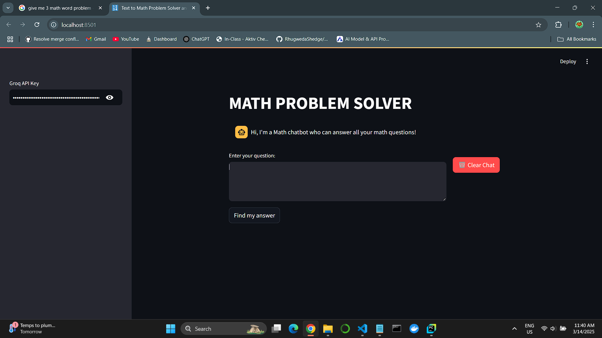

# 📌 Math Problem Solver

## 🚀 Overview
This project is a Math Problem Solver and Data Search Assistant built using Streamlit and LangChain. It allows users to input mathematical queries and retrieve answers using advanced LLM-based reasoning. The project also integrates Wikipedia search to provide contextual information for math-related topics.

## 🛠 Features
✅ Solve complex mathematical problems
✅ Retrieve factual data from Wikipedia
✅ Provide step-by-step logical reasoning for solutions
✅ User-friendly interface using Streamlit
✅ Store query history for future reference
✅ Support for multiple LLM providers

## 🏗 Tech Stack
Programming Language: Python
Frameworks & Libraries: LangChain, Streamlit, WikipediaAPIWrapper
LLM Provider: Groq (Gemma2-9b-It)
Tools: Docker, GitHub Actions

## Highlights



## 🎬 Installation & Usage
Clone the repository and install dependencies:
```
git clone https://github.com/Manishkatel/MATH_PROBLEM_SOLVER.git
cd math-problem-solver
pip install -r requirements.txt
```

### Run the application:
``` streamlit run app.py ```

## 📂 Folder Structure
math_assistant/  
│── 1-Langchain/  
│   ├── 1.1_mathsolver/  
│   │   ├── app.py              # Main application script  
│── myvenv/                     # Conda virtual environment (outside project structure)  
│── requirements.txt            # Dependencies  
│── README.md                   # Project documentation  
│── .env                        # Environment variables  
│── static/                     # Images and screenshots  

